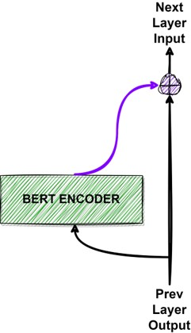
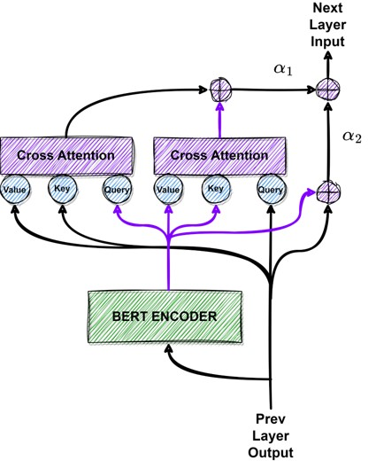
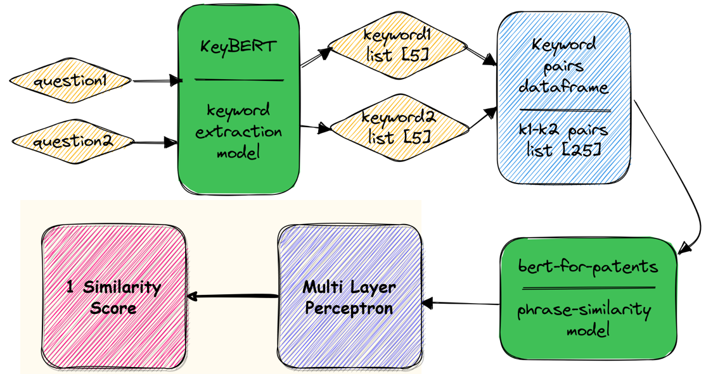

# Similarity through extracted phrases using Self-Cross Attention Bert

Term Project for CSE 472: Machine Learning Sessional offered by the CSE Department of BUET.
This project modifies the existing architecture of Bert to introduce self-cross attention and measures the performances on a semantic similarity task.  

Technology Stack:
- Frameworks: Pytorch, Sklearn, HuggingFace (models repository + modification of Bert source code)
- MLOps: Wandb

## Project Wallkthrough
### Model Modification
In the vanilla Bert encoder, the output of previous layer is added to the output with a residual connection. But this results in the direct combination of discrepant features. Instead, we can cross attend previous layer output and current layer bert encoder output to get more harmonious features. To mitigate potential adverse effects, trainable weighted summation of the original residual connection and cross attended output are used. This model is trained with the [USA Patent2Patent Matching Dataset](https://www.kaggle.com/competitions/us-patent-phrase-to-phrase-matching) in order to detect similarity between two phrases.

| Original             |  Proposed |
:-------------------------:|:-------------------------:
  |  

### Pipeline
Given a pair of sentences, [keyBERT](https://github.com/MaartenGr/KeyBERT
) is first used on each sentence to extract top 5 keyphrases. Then, the similarity of each keyword of the 1st sentence with each keyword of the 2nd sentence is extracted via the trained modified Bert model. This results in 25 scores which is passed through a MLP to get the final similarity score. 

In order to evaluate the pipeline, the [Quora Question Pair](https://www.kaggle.com/datasets/quora/question-pairs-dataset) dataset is used. Pretrained [SentenceTransformer](https://www.sbert.net/docs/pretrained_models.html) is used to generate the labels. The overall method and the results can be found in the [presentation](Final_Presentation.pptx) file.

Project Developers:
- Najibul Haque Sarker (1705044)
- Tahmeed Tarek (1705039)
  
Project Supervisor:
- Dr. Mohammed Eunus Ali
